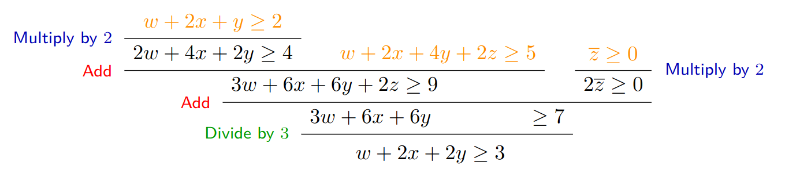

## Cutting Planes with Lean 4

[](https://github.com/bernborgess/lean-cutting-planes/actions/workflows/mdbook.yml)

This project follows the research in [Lean 4 Theorem Proving](https://lean-lang.org/) and Metaprogramming,
where we where we aim to develop a Lean 4 library for formalizing and manipulating cutting planes
in a verifiable manner, as they were described by [Jakob Nordström](https://jakobnordstrom.se/) in
[A Unified Proof System for Discrete Combinatorial Problems](https://jakobnordstrom.se/docs/presentations/TalkVeriPB_Dagstuhl23.pdf#page=45).

This work bridges the gap between the theoretical underpinnings of cutting planes—a mathematical optimization technique used in linear programming
to refine solution spaces—and the rigorous environment of theorem proving offered by Lean 4.
Our goal is to model the foundational concepts of cutting plane calculation, implement these calculations' rules,
and formally verify their correctness.

By [Bernardo Borges](https://github.com/bernborgess/) as a _capstone project_ for the
[Bachelor's degreen in Computer Science](https://dcc.ufmg.br/bacharelado-em-ciencia-da-computacao/)
at [Universidade Federal de Minas Gerais](https://ufmg.br/).

## Documentation

This manual is generated by _mdBook_.

You can read the [docs](https://bernborgess.github.io/lean-cutting-planes/) here.

Run `mdbook test` to test all `lean` code blocks.

## Example

We want to represent Pseudo-Boolean formulas to decide whether they are _satisfiable_. For instance,
$$-x_1 + 2x_2 - 3x_3 + 4x_4 - 5x_5 \ge 1 $$
will be represented as

```lean
open PseudoBoolean

def my_pb : PBProp ![-1,2,-3,4,-5] 1 := sorry
```

This notation is under development and is subject to changes.

Now we can manipulate `PB`s, similarly to this `Toy Example`:



```lean
example (c1 : PBProp ![1,2,1,0] 2)
        (c2 : PBProp ![1,2,4,2] 5)
        (c3 : PBProp ![0,0,0,-1] (-1))
        : PBProp ![1,2,2,0] 3
  := by
  let h2z : 2 > 0 := Nat.zero_lt_succ 1
  let h3z : 3 > 0 := Nat.zero_lt_succ 2
  let t1 : PBProp ![2,4,2,0] 4      := Multiplication ![1,2,1,0] 2 c1 2 h2z
  let t2 : PBProp ![3,6,6,2] 9      := Addition ![2,4,2,0] 4 t1 ![1,2,4,2] 5 c2
  let t3 : PBProp ![0,0,0,-2] (-2)  := Multiplication ![0,0,0,-1] (-1) c3 2 h2z
  let t4 : PBProp ![3,6,6,0] 7      := Addition ![3,6,6,2] 9 t2 ![0,0,0,-2] (-2) t3
  exact Division ![3,6,6,0] 7 t4 3 h3z
  done
```
